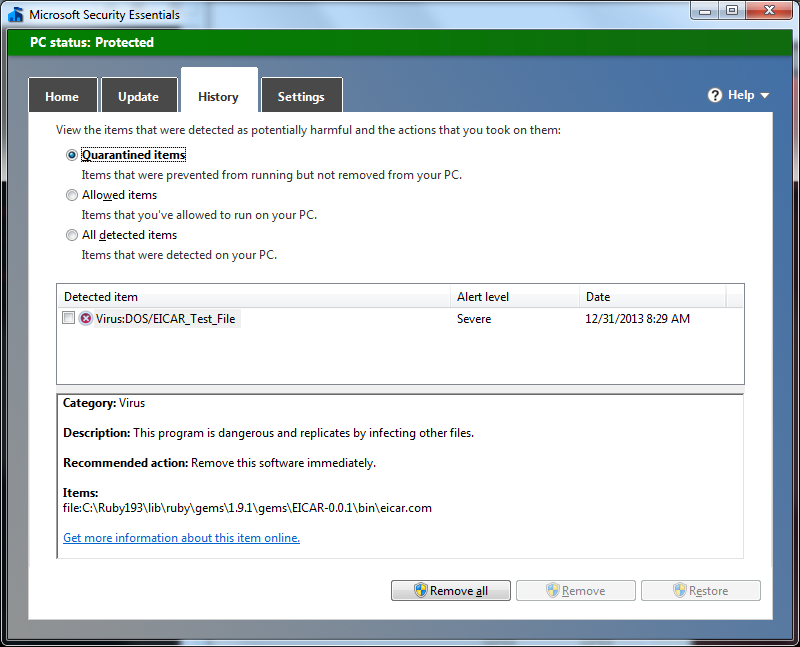

EICAR
=====

The EICAR gem provides the [EICAR test
file](https://en.wikipedia.org/wiki/EICAR_test_file) as [bin/eicar.com],
used to test anti-virus detection functionality.

Usage
=====

If you believe you have anti-virus checking your rubygems install path,
you can check to make sure with simply:

````ruby
require 'eicar'
````

If anti-virus is active, this will raise `EICAR::EICARReadError`.
Therefore, code that wants anti-virus active should `rescue` this on
load. I know, it's a little backwards.

Code exercising this might look like this:

````ruby
#!/usr/bin/env ruby

begin
  require 'eicar'
rescue EICAR::EICARReadError
  @antivirus_active = true
end
````

If A/V is later enabled, an application can monitor its status. Here's a
simplistic example:

````ruby
until EICAR.antivirus_active? do
  sleep 1
  puts "A/V hasn't caught EICAR yet"
end
puts "A/V is active in #{ENV['GEM_HOME']}."
````

Expected Results
================

Below is a screenshot from Microsoft Security Essentials successfully
detecting [bin/eicar.com] and placing it in quarantine.



TODO
====

Actual specs for testing

